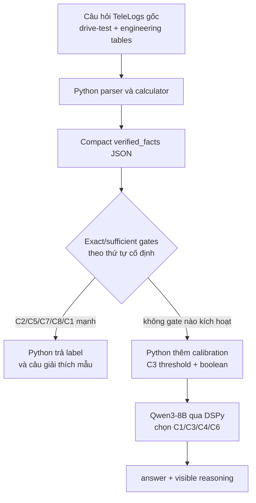

# TeleLogs: logic suy luận và trace đáp án của pipeline accuracy cao hiện tại

## 1. Tóm tắt đúng bản chất

Pipeline cho kết quả cao nhất hiện tại là `CalibratedHybridTeleLogsProgram`.
Đây là một **hệ thống lai giữa bộ tính toán Python, rule routing và Qwen3-8B
qua DSPy**, không phải pipeline trong đó Qwen tự đọc toàn bộ câu hỏi gốc rồi tự
suy luận từ đầu đến cuối.

Luồng thực tế:



Hai điểm cần nhớ:

1. Model hiện tại chỉ nhận `verified_facts` dạng JSON cô đọng. Model **không
   nhận câu hỏi gốc và không nhìn trực tiếp hai bảng raw** trong pipeline DSPy
   accuracy cao này.
2. `reasoning` hiện tại là một **audit trace nhìn thấy được**, không phải native
   chain-of-thought của Qwen. Native thinking được cấu hình `False`.

Vì vậy, kết quả 90–94% nên được gọi là **accuracy của hệ thống
calculator/rule-assisted**, không phải accuracy thuần của Qwen3-8B.

---

## 2. Các thành phần chính trong code

| Thành phần | Vai trò |
|---|---|
| `scripts/exhaustive_review_v11.py` | Parse câu hỏi gốc, join bảng, tính toán row-level và aggregate facts |
| `scripts/generate_reasoning_v13.py` | Biến các phép tính thành evidence/gates C1–C8 |
| `scripts/generate_reasoning_v14.py` | Rút gọn evidence thành compact facts đưa vào DSPy |
| `infra/telelogs-dspy/prepare_data.py` | Tạo train/dev/holdout theo template group |
| `infra/telelogs-dspy/prepare_official_test.py` | Tính facts cho official set; label chỉ dùng làm target chấm điểm |
| `infra/telelogs-dspy/telelogs_program.py` | Exact routing, calibrated residual prompt và metric |
| `infra/telelogs-dspy/calibrate_residual_threshold.py` | Tìm ngưỡng C3 trên train split |
| `infra/telelogs-dspy/run_stage.py` | Cấu hình Qwen/DSPy, chạy infer và ghi predictions/summary |

Artifact dùng để trace:

| Artifact | Nội dung |
|---|---|
| `artifacts/telelogs-dspy/data/telelogs_train_splits.jsonl` | `verified_facts` của train/dev/holdout |
| `artifacts/telelogs-dspy/data/telelogs_official_facts.jsonl` | `verified_facts` của official |
| `artifacts/telelogs-dspy/results/<run>/predictions.jsonl` | Đáp án, reasoning và decision path từng câu |
| `artifacts/telelogs-dspy/results/<run>/summary.json` | Accuracy, per-label, confusion và tỷ lệ từng decision path |
| `artifacts/telelogs-dspy/calibration_threshold.json` | Kết quả fit ngưỡng C3 |

---

## 3. Bước 1 — Python đọc và chuẩn hóa câu hỏi raw

Đầu vào raw gồm:

- bảng drive-test theo từng timestamp/observation;
- bảng engineering parameters của cell;
- các cột serving PCI, neighbor PCI, RSRP/BRSRP, throughput, RB, GPS,
  speed và thông số antenna.

Parser tách câu hỏi ở chuỗi:

```text
Engeneering parameters data as follows：
```

Sau đó nó tạo hai bảng:

- `drive_rows`: các observation ngoài hiện trường;
- `engineering_rows`: thông số cell dùng để join theo PCI.

### 3.1. Các cột drive-test được dùng

- `Longitude`
- `Latitude`
- `GPS Speed (km/h)`
- `5G KPI PCell RF Serving PCI`
- `5G KPI PCell RF Serving SS-RSRP [dBm]`
- `5G KPI PCell Layer2 MAC DL Throughput [Mbps]`
- `5G KPI PCell Layer1 DL RB Num (Including 0)`
- các cột neighbor PCI;
- các cột neighbor `Filtered Tx BRSRP [dBm]`.

### 3.2. Các cột engineering được dùng

- `gNodeB ID`
- `Longitude`
- `Latitude`
- `Mechanical Downtilt`
- `Digital Tilt`
- `Beam Scenario`
- `Height`
- `PCI`

`Digital Tilt = 255` được thay bằng `6` trước khi cộng với mechanical tilt.

Beamwidth dọc được quy đổi theo scenario:

- `DEFAULT` và `SCENARIO_1` đến `SCENARIO_5`: 6 độ;
- `SCENARIO_6` đến `SCENARIO_11`: 12 độ;
- các trường hợp khác: 25 độ.

### 3.3. Feature tính cho từng drive-test row

Với mỗi row, Python lấy hoặc tính:

- serving PCI;
- speed;
- serving RSRP;
- throughput;
- scheduled RB;
- khoảng cách từ UE đến serving cell bằng Haversine;
- góc elevation từ UE lên antenna;
- lower/upper edge của main lobe;
- danh sách neighbor có cùng PCI modulo 30;
- chênh lệch `neighbor BRSRP - serving RSRP` với neighbor không cùng gNodeB.

Công thức geometry chính:

```text
distance_km = Haversine(UE lon/lat, serving-cell lon/lat)

elevation_deg = atan2(cell_height_m, distance_km * 1000)

total_tilt_deg = mechanical_tilt + normalized_digital_tilt

main_lobe_lower_deg = total_tilt_deg - vertical_beamwidth_deg / 2
main_lobe_upper_deg = total_tilt_deg + vertical_beamwidth_deg / 2
```

Nếu không có đủ engineering data cho mọi serving PCI, distance/geometry tương
ứng có thể là `null`; C2 khi đó trở thành `inconclusive`, không tự động là âm.

---

## 4. Bước 2 — Xác định đoạn bị ảnh hưởng

Một row được coi là **affected row** khi:

```text
throughput_mbps < 600
```

Đây là so sánh `<`, không phải `<=`:

- 599.99 Mbps: affected;
- đúng 600 Mbps: không affected.

Affected rows được dùng để tính hoặc kiểm tra C1, C4, C6 và C8. Vì thế phần lớn
evidence không chỉ cần xuất hiện ở bất kỳ row nào; nó phải được **row-aligned
với throughput thấp**.

Các aggregate chính:

- tổng số observation;
- số affected rows;
- minimum throughput;
- maximum speed;
- maximum serving distance;
- serving PCI sequence;
- số lần serving PCI thay đổi;
- average scheduled RB trên affected rows;
- throughput min/max/mean theo từng serving PCI;
- geometry theo serving PCI;
- các witness C1/C4/C6 trên affected row.

---

## 5. Bước 3 — Tạo evidence cho từng nhãn C1–C8

### 5.1. C1 — UE nằm dưới lower main lobe / dấu hiệu downtilt

Điều kiện hình học:

```text
affected_below_lower_lobe =
    tồn tại affected row mà
    ue_elevation_deg < main_lobe_lower_deg
```

Điều kiện mạnh hơn:

```text
affected_weak_rsrp_witness =
    tồn tại affected row mà
    ue_elevation_deg < main_lobe_lower_deg
    và serving_rsrp_dbm <= -90
```

Trong routing hiện tại:

- `affected_below_lower_lobe = true` chỉ là evidence cần xem xét ở residual;
- `affected_weak_rsrp_witness = true` được coi là **sufficient evidence** và
  Python trả thẳng `C1`.

### 5.2. C2 — Serving-cell overshooting

```text
distance_gate =
    triggered      nếu maximum_distance_km > 1
    not_triggered  nếu maximum_distance_km <= 1
    inconclusive   nếu thiếu engineering data
```

`triggered` là exact gate và trả thẳng `C2`.

### 5.3. C3 — Serving segment khác có throughput tương đối tốt hơn

Python nhóm throughput theo serving PCI, rồi lấy minimum của mỗi nhóm:

```text
affected_pci = PCI có segment minimum thấp nhất
alternative_pci = PCI còn lại có segment minimum cao nhất

minimum_advantage_mbps =
    alternative_min_mbps - affected_min_mbps
```

Ví dụ:

```text
affected PCI minimum    = 451.55 Mbps
alternative PCI minimum = 594.49 Mbps
advantage                = 142.94 Mbps
```

C3 được xem là một residual diagnosis sau khi đã loại các exact/sufficient
mechanism mạnh hơn.

### 5.4. C4 — Non-colocated overlap

Tại affected row, với mỗi neighbor:

1. neighbor và serving cell phải khác `gNodeB ID`;
2. tính:

```text
gap_db = neighbor_filtered_tx_brsrp_dbm - serving_rsrp_dbm
```

Gate:

```text
affected_overlap_gate =
    tồn tại affected row có maximum gap_db >= -3 dB
```

Ví dụ gap `-2.01 dB` đạt gate; gap `-3.20 dB` không đạt.

Trong prompt gốc, đây được mô tả là necessary evidence, không phải một proof
độc lập. Trong calibrated residual policy, nó là witness residual có độ ưu tiên
cao nhất khi C3 chưa đạt strong threshold.

### 5.5. C5 — Serving PCI thay đổi thường xuyên

```text
change_count =
    số lần serving_pci[i] != serving_pci[i - 1]

frequent_change_gate = change_count >= 3
```

Ví dụ sequence:

```text
330 -> 591 -> 330 -> 591
```

có 3 lần thay đổi, nên gate kích hoạt và Python trả thẳng `C5`.

### 5.6. C6 — PCI modulo-30 collision

Tại affected row, kiểm tra neighbor:

```text
neighbor_pci % 30 == serving_pci % 30
```

Nếu tồn tại, đặt:

```text
affected_modulo_30_collision = true
```

Ví dụ:

```text
serving PCI 712 % 30 = 22
neighbor PCI 832 % 30 = 22
```

Đây là một eligibility/interference signal theo benchmark, không phải phép đo
DMRS interference trực tiếp. Trong calibrated residual, C6 đứng sau C4.

### 5.7. C7 — Tốc độ cao

```text
speed_gate = maximum_speed_kmh > 40
```

Đây là so sánh `>`:

- 40.0 km/h: không kích hoạt;
- 40.01 km/h: kích hoạt.

Gate kích hoạt thì Python trả thẳng `C7`.

### 5.8. C8 — Thiếu scheduled RB ở đoạn affected

```text
affected_average_scheduled_rbs =
    mean(scheduled_rbs của tất cả affected rows)

affected_average_rb_gate =
    affected_average_scheduled_rbs < 160
```

Pipeline dùng **average trên affected rows**, không dùng minimum RB của toàn
log. Gate kích hoạt thì Python trả thẳng `C8`.

---

## 6. Bước 4 — Compact facts mà Qwen thực sự nhìn thấy

Sau parser/calculator, raw question được rút thành JSON dạng:

```json
{
  "affected": {
    "rows": 4,
    "minimum_throughput_mbps": 360.98
  },
  "C1": {
    "affected_below_lower_lobe": false,
    "affected_weak_rsrp_witness": false,
    "witness": null
  },
  "C2": {
    "distance_gate": "inconclusive",
    "maximum_distance_km": null
  },
  "C3": {
    "affected_pci": 832,
    "affected_min_mbps": 360.98,
    "alternative_pci": 712,
    "alternative_min_mbps": 403.85,
    "minimum_advantage_mbps": 42.87
  },
  "C4": {
    "affected_overlap_gate": false,
    "witness": null
  },
  "C5": {
    "change_count": 1,
    "frequent_change_gate": false
  },
  "C6": {
    "affected_modulo_30_collision": true,
    "witness": {
      "row": 3,
      "serving_pci": 712,
      "neighbor_pci": 832,
      "modulo_30_residue": 22,
      "throughput_mbps": 458.51
    }
  },
  "C7": {
    "maximum_speed_kmh": 28.0,
    "speed_gate": false
  },
  "C8": {
    "affected_average_scheduled_rbs": 194.89,
    "affected_average_rb_gate": false
  }
}
```

Trong `run_stage.py`, DSPy example được khai báo:

```python
dspy.Example(...).with_inputs("verified_facts")
```

và inference gọi:

```python
program(verified_facts=row["verified_facts"])
```

Không có `question`, raw drive-test table hoặc raw engineering table trong lời
gọi model này.

---

## 7. Bước 5 — Exact/sufficient routing bằng Python

`CalibratedHybridTeleLogsProgram` kế thừa routing của
`HybridTeleLogsProgram`. Thứ tự hiện tại là:

```python
if C2.distance_gate == "triggered":
    return C2
elif C5.frequent_change_gate:
    return C5
elif C7.speed_gate:
    return C7
elif C8.affected_average_rb_gate:
    return C8
elif C1.affected_weak_rsrp_witness:
    return C1
else:
    call Qwen residual diagnosis
```

Thứ tự này có ý nghĩa quyết định. Nếu một sample đồng thời kích hoạt nhiều
gate, **gate xuất hiện trước thắng**:

```text
C2 > C5 > C7 > C8 > strong C1 > residual LM
```

Ở năm nhánh direct:

- Qwen không được gọi;
- label được Python chọn hoàn toàn;
- `reasoning` được Python ghép bằng f-string;
- `decision_path = "deterministic_gate"`.

Ví dụ thực tế, source index 44 có:

```text
C2.distance_gate = triggered
C2.maximum_distance_km = 2.602
C4.affected_overlap_gate = true
C3.minimum_advantage_mbps = 1264.21
```

Do C2 đứng đầu, C4 và C3 không được xét tiếp. Kết quả:

```text
answer: C2
reasoning: C2 exact distance gate triggered; maximum distance is 2.602 km.
decision_path: deterministic_gate
```

Cả `answer` và `reasoning` ở ví dụ này đều do code tạo, không phải Qwen.

---

## 8. Bước 6 — Calibrated residual policy cho C1/C3/C4/C6

Nếu không có exact/sufficient gate nào ở trên, Python thêm:

```json
"_prompt_calibration": {
  "source": "train_split_only_threshold_sweep",
  "role": "ranking_prior_not_ground_truth",
  "c3_strong_minimum_advantage_mbps": 142.5,
  "c3_strong_advantage": true,
  "below_threshold_witness_order": [
    "C4.affected_overlap_gate",
    "C6.affected_modulo_30_collision",
    "C1.affected_below_lower_lobe",
    "C3.residual"
  ]
}
```

Boolean được tính bằng Python:

```text
c3_strong_advantage =
    C3.minimum_advantage_mbps >= 142.5
```

Mục đích của boolean là tránh Qwen tính sai so sánh số thập phân. Nghĩa là
Qwen không cần tự xác định `142.94 >= 142.5`; Python đã trả sẵn `true`.

Policy được prompt yêu cầu:

```python
if c3_strong_advantage:
    C3
elif C4.affected_overlap_gate:
    C4
elif C6.affected_modulo_30_collision:
    C6
elif C1.affected_below_lower_lobe:
    C1
else:
    C3
```

Qwen vẫn là component phát ra hai field:

```text
reasoning: ...
answer: C1 | C3 | C4 | C6
```

Tuy nhiên, vì policy đã rất cụ thể và boolean quan trọng nhất đã được code tính,
vai trò của Qwen ở nhánh này gần với:

1. đọc các boolean/facts;
2. thực thi thứ tự ưu tiên;
3. viết giải thích bằng ngôn ngữ tự nhiên;
4. trả đúng format.

Trong các run đã báo cáo, Qwen theo đúng calibrated policy 224/224 ở matched dev
và 479/479 ở secondary holdout. Do đó về hành vi, nhánh residual hiện tại gần
với một decision tree có phần diễn đạt bằng model hơn là suy luận mở hoàn toàn.

---

## 9. Nguồn gốc ngưỡng C3 = 142.5 Mbps

Script calibration:

```text
infra/telelogs-dspy/calibrate_residual_threshold.py
```

Quy trình:

1. chỉ lấy các sample `split == "train"`;
2. loại các sample đã rơi vào C2/C5/C7/C8/strong-C1 direct gates;
3. còn 567 residual examples;
4. sweep threshold theo bước 0.5 Mbps;
5. với mỗi threshold, chạy decision policy C3/C4/C6/C1;
6. chọn threshold có train accuracy cao nhất;
7. nếu nhiều threshold đồng hạng, chọn threshold nhỏ nhất.

Kết quả lưu trong `calibration_threshold.json`:

```text
residual train examples = 567
selected threshold       = 142.5 Mbps
correct                  = 461
train residual accuracy  = 81.31%
```

Ngưỡng được fit từ train labels. Tuy nhiên, toàn bộ thiết kế hệ thống và thứ tự
policy đã trải qua nhiều vòng xem dev/holdout và kết quả official cũ. Vì vậy:

- có thể nói ngưỡng cụ thể được fit trên train;
- không nên nói toàn bộ phương pháp là hoàn toàn không chịu ảnh hưởng từ
  evaluation feedback;
- dev và secondary holdout hiện mang tính exploratory;
- chưa còn một pristine test riêng cho calibrated pipeline mới.

---

## 10. “Thinking” và “reasoning” hiện tại chính xác là gì?

### 10.1. Native Qwen thinking

Trong cấu hình LM:

```python
extra_body={
    "chat_template_kwargs": {
        "enable_thinking": False
    }
}
```

Do đó pipeline accuracy cao hiện tại **không bật native thinking mode** của
Qwen3-8B.

### 10.2. Visible reasoning field

DSPy Signature yêu cầu:

```text
reasoning: concise decisive evidence, tối đa 120 words
answer: đúng một nhãn
```

Đây là phần giải thích có cấu trúc để audit:

- direct path: code viết;
- residual path: Qwen viết;
- không nên đồng nhất field này với hidden chain-of-thought;
- reasoning này có thể kiểm tra lại với `verified_facts`.

### 10.3. Vì sao vẫn có reasoning khi answer do code chọn?

Hàm `_direct(reasoning, answer)` trả một `dspy.Prediction` đầy đủ:

```python
dspy.Prediction(
    reasoning=reasoning,
    answer=answer,
    decision_path="deterministic_gate"
)
```

Ví dụ C7:

```text
reasoning: C7 exact speed gate triggered; maximum speed is 70.0 km/h.
answer: C7
```

Đó là một explanation/template trace hợp lệ của rule engine, nhưng không phải
model tự phát hiện và tự giải thích.

---

## 11. Trace chi tiết ba loại sample

### 11.1. Sample direct C2

Source index 44:

```text
maximum_distance_km = 2.602
distance_gate       = triggered
```

Trace:

```text
1. Check C2: triggered -> dừng.
2. Không check C5/C7/C8/C1/residual.
3. Python chọn C2.
4. Python sinh reasoning từ distance.
```

Output:

```text
answer = C2
decision_path = deterministic_gate
```

### 11.2. Sample residual C3

Source index 140:

```text
C2 = not_triggered
C5 = false
C7 = false
C8 = false
strong C1 = false
C3 advantage = 142.94 Mbps
```

Calibration:

```text
142.94 >= 142.5 -> c3_strong_advantage = true
```

Trace:

```text
1. Không direct gate nào active.
2. Python thêm c3_strong_advantage=true.
3. Qwen đọc calibrated facts.
4. Prompt quy định strong C3 đứng trên C4/C6/C1.
5. Qwen trả reasoning + C3.
```

Output thực tế:

```text
reasoning:
The `c3_strong_advantage` is true, indicating a strong positive evidence
for C3. Since the threshold is met, C3 outranks all other witnesses...

answer = C3
decision_path = dspy_calibrated_residual_lm
```

### 11.3. Sample residual C6

Source index 157:

```text
C2 = inconclusive
C5 = false
C7 = false
C8 = false
strong C1 = false
C3 advantage = 42.87 Mbps
C4 overlap = false
C6 modulo-30 collision = true
C1 below lower lobe = false
```

Calibration:

```text
42.87 >= 142.5 -> false
```

Residual order:

```text
C4(false) -> C6(true) -> chọn C6
```

Output thực tế:

```text
answer = C6
decision_path = dspy_calibrated_residual_lm
```

Ở đây phép modulo, affected-row alignment và boolean C6 đều do Python tính.
Qwen thực thi policy và diễn đạt lý do.

---

## 12. Chấm điểm đáp án

`normalize_answer()` tìm mọi pattern `C1` đến `C8` trong output `answer` và lấy
match cuối cùng:

```python
matches = re.findall(r"\bC([1-8])\b", answer)
normalized = f"C{matches[-1]}" if matches else ""
```

Metric:

```text
correct = normalized_prediction == gold_label
```

Reasoning không được chấm semantic correctness trong exact accuracy. Một sample
có thể:

- có label đúng nhưng explanation thiếu hoặc không nhất quán;
- vẫn được tính đúng theo exact-label metric.

Ngược lại, nếu reasoning nói đúng nhưng field `answer` không chứa C1–C8 thì sample
bị tính sai.

Mỗi prediction lưu:

- `source_index`;
- `target`;
- `answer`;
- `correct`;
- `reasoning`;
- `decision_path`;
- `reasoning_words`;
- latency;
- error.

---

## 13. Kết quả và mức đóng góp của code/model

### 13.1. Latest calibrated matched dev

```text
209 / 224 = 93.30%
```

Decision paths:

```text
deterministic_gate             = 131 / 224 = 58.48%
dspy_calibrated_residual_lm    =  93 / 224 = 41.52%
```

Per-label:

| Label | Correct/total | Accuracy |
|---|---:|---:|
| C1 | 22/28 | 78.57% |
| C2 | 28/28 | 100.00% |
| C3 | 26/28 | 92.86% |
| C4 | 26/28 | 92.86% |
| C5 | 28/28 | 100.00% |
| C6 | 23/28 | 82.14% |
| C7 | 28/28 | 100.00% |
| C8 | 28/28 | 100.00% |

### 13.2. Secondary holdout

```text
450 / 479 = 93.95%
```

Decision paths:

```text
deterministic_gate             = 290 / 479 = 60.54%
dspy_calibrated_residual_lm    = 189 / 479 = 39.46%
```

Secondary holdout không còn là final pristine test vì aggregate behavior đã được
xem trong quá trình phát triển.

### 13.3. Official result hiện có

Official frozen result:

```text
779 / 864 = 90.16%
```

Nhưng đây là **earlier hybrid**, chưa có calibrated C3 boolean mới:

```text
deterministic_gate = 488 / 864
dspy_residual_lm   = 376 / 864
```

Không được gán 93.95% cho official benchmark. Calibrated pipeline chưa được rerun
trên official sau khi prompt/policy mới được chọn.

### 13.4. So với model raw

Raw Qwen3-8B official baseline đã ghi nhận:

```text
315 / 864 = 36.46%
```

Chênh lệch lớn từ 36.46% lên 90–94% đến chủ yếu từ:

- Python parse và tính toán chính xác;
- chuyển bảng dài thành facts cô đọng;
- row alignment;
- exact/sufficient gates;
- fixed evidence hierarchy;
- train-calibrated C3 boolean;
- Qwen chỉ xử lý residual decision và diễn đạt.

---

## 14. Vì sao pipeline đạt accuracy cao?

### 14.1. Giảm bài toán đọc bảng dài

Qwen không phải tự:

- tìm đúng cột;
- parse hàng;
- join PCI với engineering table;
- tính Haversine;
- tính elevation/beam edge;
- đếm handover;
- tính modulo;
- lấy average RB;
- so sánh nhiều số thập phân.

Những lỗi arithmetic và table attention bị loại khỏi phần model.

### 14.2. Exact classes được route không có sai số sampling

C2/C5/C7/C8 và strong C1 được giải bằng code. Với temperature `0.0`, residual
Qwen cũng có tính ổn định cao hơn.

### 14.3. Label space residual nhỏ hơn

Sau direct routing, Qwen chỉ cần chọn:

```text
C1, C3, C4 hoặc C6
```

### 14.4. Priority policy xử lý conflict

Thay vì để model tự phát minh causal hierarchy, prompt quy định rõ:

```text
strong C3 > C4 > C6 > C1 > residual C3
```

Điều này giảm confusion C3/C4/C6/C1.

### 14.5. Boolean tránh lỗi so sánh ngưỡng

Qwen từng có thể diễn giải sai các giá trị như 39.55 hoặc 18.28 so với 142.5.
`c3_strong_advantage` loại bỏ lỗi đó.

---

## 15. Các giới hạn và rủi ro trace hiện tại

### 15.1. Đây không phải pure prompting

Phần lớn accuracy cao đến từ preprocessing và rule engine. Nếu mục tiêu leaderboard
yêu cầu raw input → model output và không cho external rule/calculator, cần xác
minh pipeline này có hợp lệ hay không.

### 15.2. Qwen không thể kiểm tra lỗi parser

Vì chỉ nhận compact facts, Qwen không thể phát hiện:

- parser lấy nhầm cột;
- row bị lệch;
- engineering join sai;
- công thức geometry sai;
- witness bị chọn sai.

Nếu calculator sai, model thường sẽ giải thích rất tự tin dựa trên fact sai.

### 15.3. Residual reasoning không thực sự độc lập

Qwen đã theo policy 100% trong hai run được kiểm tra. Vì vậy reasoning cho biết
“model đã thực thi policy thế nào”, chưa chứng minh model tự khám phá mechanism.

### 15.4. Exact-label metric không chấm chất lượng reasoning

Accuracy hiện tại không phạt explanation không nhất quán nếu label vẫn đúng.
Cần thêm reasoning-grounding checks nếu muốn báo cáo chất lượng giải thích.

### 15.5. Có một mismatch C1 witness đáng chú ý

`affected_weak_rsrp_witness` là boolean “tồn tại ít nhất một weak row”, nhưng
`strongest_c1_witness()` hiện chọn row dưới lower lobe theo distance/throughput,
không bắt buộc chính row đó có `RSRP <= -90`.

Ví dụ source index 230:

```text
affected_weak_rsrp_witness = true
stored witness RSRP        = -84.44 dBm
stored witness weak flag   = false
```

Direct reasoning lại ghi:

```text
C1 sufficient weak-RSRP witness is present at -84.44 dBm.
```

Label C1 có thể vẫn đúng vì một row khác đã làm boolean weak trở thành true,
nhưng câu reasoning đang trỏ sai witness. Đây là lỗi audit-trace cần sửa bằng
một trong hai cách:

1. lưu riêng `weak_witness` và dùng đúng row `RSRP <= -90`; hoặc
2. reasoning chỉ nói boolean strong C1 đã active mà không gán RSRP của một row
   khác.

### 15.6. Ngưỡng và hierarchy vẫn là benchmark-specific

Các threshold 600, 1 km, -3 dB, 3 changes, 40 km/h, 160 RB và calibrated 142.5
được thiết kế cho logic/dữ liệu TeleLogs hiện tại. Không nên mặc định chúng tổng
quát sang log thực địa khác hoặc benchmark khác.

### 15.7. Chưa có pristine final test cho calibrated pipeline

Official cũ chỉ phản ánh earlier hybrid. Dev và holdout mới đã được quan sát.
Muốn có estimate sạch cần:

- một tập template-group hoàn toàn mới chưa từng xem;
- private leaderboard;
- hoặc nested group cross-validation và báo đúng là CV, không gọi là test.

---

## 16. Checklist để trace một đáp án cụ thể

Với `source_index = N`:

### Bước A — Lấy facts

Tìm row tương ứng trong:

```text
artifacts/telelogs-dspy/data/telelogs_train_splits.jsonl
```

hoặc official:

```text
artifacts/telelogs-dspy/data/telelogs_official_facts.jsonl
```

### Bước B — Tự đi qua direct gates đúng thứ tự

```text
1. C2.distance_gate == triggered?
2. C5.frequent_change_gate == true?
3. C7.speed_gate == true?
4. C8.affected_average_rb_gate == true?
5. C1.affected_weak_rsrp_witness == true?
```

Gate đầu tiên đúng chính là answer; model không chạy.

### Bước C — Nếu residual

Tính:

```text
C3.minimum_advantage_mbps >= 142.5?
```

Sau đó đi theo:

```text
strong C3 -> C4 -> C6 -> C1 -> C3 residual
```

### Bước D — Đối chiếu prediction

Mở:

```text
artifacts/telelogs-dspy/results/<run>/predictions.jsonl
```

Kiểm tra:

- `answer`;
- `reasoning`;
- `decision_path`;
- `target`;
- `correct`.

### Bước E — Xác định ai đã tạo đáp án

```text
decision_path = deterministic_gate
    -> answer + reasoning đều do Python

decision_path = dspy_residual_lm
    -> Qwen sinh answer + reasoning từ compact facts

decision_path = dspy_calibrated_residual_lm
    -> Python thêm threshold/boolean;
       Qwen sinh answer + reasoning theo calibrated policy
```

### Bước F — Audit reasoning

Không chỉ nhìn `correct=true`. Cần hỏi:

1. reason có trích đúng field không?
2. số trong reason có khớp facts không?
3. witness có đúng affected row không?
4. nếu nhiều gate conflict, output có theo đúng priority không?
5. label đúng là do mechanism đúng hay do rule tình cờ khớp target?

---

## 17. Pseudocode đầy đủ của pipeline hiện tại

```python
def solve_telelogs(raw_question):
    # Stage 1: deterministic preprocessing
    drive_rows, engineering_rows = parse_tables(raw_question)
    observations = join_and_calculate(drive_rows, engineering_rows)

    affected_rows = [
        row for row in observations
        if row.throughput_mbps < 600
    ]

    facts = build_compact_facts(
        observations=observations,
        affected_rows=affected_rows,
        distance_threshold_km=1,
        weak_rsrp_threshold_dbm=-90,
        overlap_gap_threshold_db=-3,
        frequent_change_threshold=3,
        speed_threshold_kmh=40,
        affected_average_rb_threshold=160,
    )

    # Stage 2: deterministic exact/sufficient routing
    if facts.C2.distance_gate == "triggered":
        return code_prediction("C2", c2_reason(facts))

    if facts.C5.frequent_change_gate:
        return code_prediction("C5", c5_reason(facts))

    if facts.C7.speed_gate:
        return code_prediction("C7", c7_reason(facts))

    if facts.C8.affected_average_rb_gate:
        return code_prediction("C8", c8_reason(facts))

    if facts.C1.affected_weak_rsrp_witness:
        return code_prediction("C1", c1_reason(facts))

    # Stage 3: code-derived calibration feature
    facts._prompt_calibration = {
        "threshold_mbps": 142.5,
        "c3_strong_advantage": (
            facts.C3.minimum_advantage_mbps >= 142.5
        ),
        "priority": ["C4", "C6", "C1", "C3"],
    }

    # Stage 4: language-model rendering/selection
    prediction = qwen3_8b_dspy(
        verified_facts=facts,
        allowed_answers=["C1", "C3", "C4", "C6"],
        native_thinking=False,
        temperature=0.0,
    )

    return {
        "answer": normalize_last_c1_to_c8(prediction.answer),
        "reasoning": prediction.reasoning,
        "decision_path": "dspy_calibrated_residual_lm",
    }
```

---

## 18. Kết luận

Logic đạt accuracy cao hiện tại có ba lớp:

1. **Calculator layer**: biến raw tables thành facts đúng và ngắn.
2. **Deterministic decision layer**: giải trực tiếp các class có threshold/gate
   rõ ràng.
3. **DSPy/Qwen residual layer**: xử lý C1/C3/C4/C6 theo train-calibrated policy
   và sinh explanation.

Đây là pipeline có khả năng audit tốt hơn raw Qwen vì mọi phép tính quan trọng
đều hiện rõ trong facts. Đổi lại, nó không còn là một phép đo “model tự suy luận”
thuần túy. Khi báo cáo kết quả nên luôn ghi đồng thời:

- input của model là raw hay verified facts;
- tỷ lệ direct-code và LM;
- native thinking bật hay tắt;
- official hay exploratory split;
- accuracy của label;
- chất lượng/grounding của reasoning.
