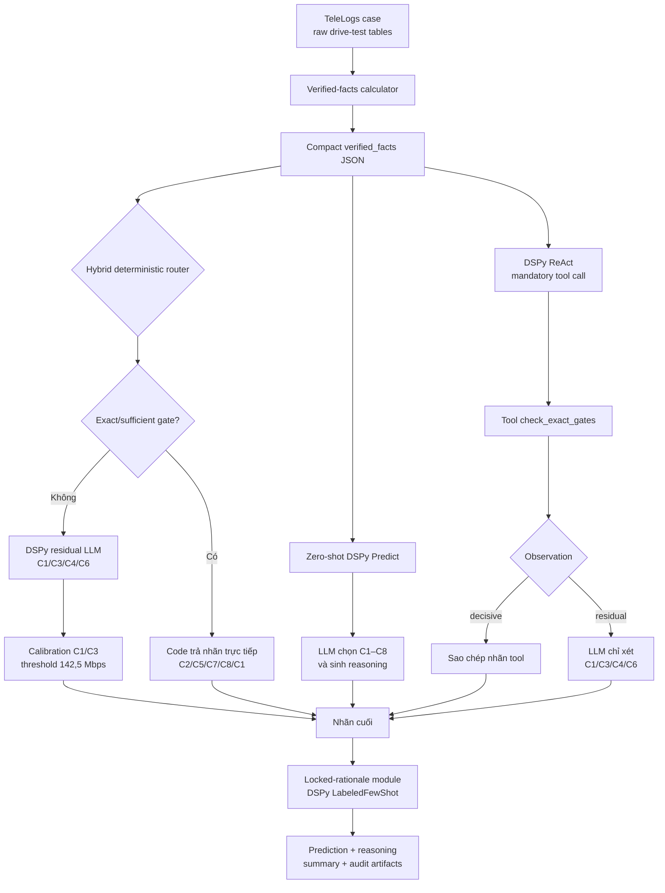
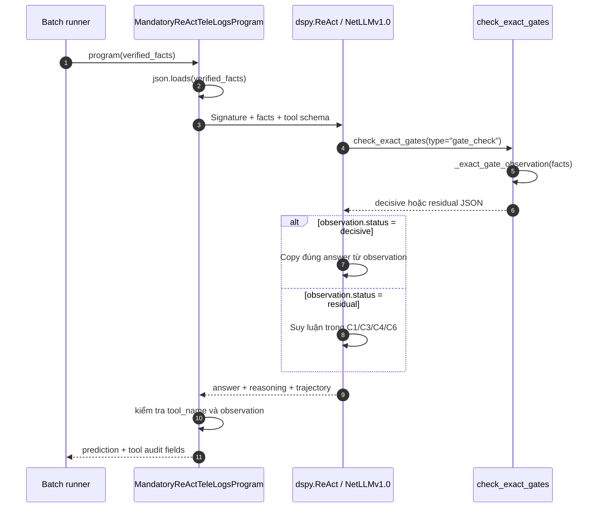
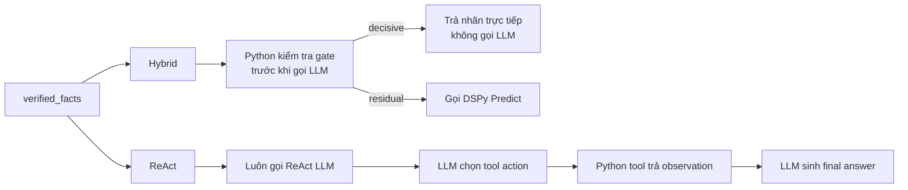

# Báo cáo các thử nghiệm TeleLogs trên NetLLMv1.0

**Ngày tổng hợp:** 2026-07-29  
**Trạng thái:** Tổng hợp từ các artifact còn được lưu trong repository  
**Phạm vi:** Verified facts, zero-shot, hybrid deterministic, DSPy/ReAct,
GEPA, locked rationale và calibration C1/C3

## 1. Tóm tắt kết quả

Kết quả tốt nhất đã chạy đầy đủ trên tập `official` 864 mẫu bằng NetLLMv1.0 là:

- **789/864 = 91,32%**
- Không có lỗi API trong bản tổng kết.
- Cấu hình: `workers=5`, `max_tokens=400`, thinking tắt.
- Verified facts được đưa vào pipeline trước khi phân loại.
- C2, C5, C7 và C8 đạt 100%.
- Calibration giúp C1/C3 tăng rõ rệt nhưng làm giảm C4 và C6 so với hybrid cũ.

| Thử nghiệm | Tập đánh giá | Đúng | Accuracy |
|---|---:|---:|---:|
| Verified-facts zero-shot baseline | official 864 | 747 | 86,46% |
| Hybrid deterministic + LLM | official 864 | 783 | 90,63% |
| GEPA hybrid | official 864 | 783 | 90,63% |
| Calibrated C1/C3 | holdout 479 | 450 | 93,95% |
| Calibrated C1/C3 | official 864 | 789 | **91,32%** |
| C1/C3/C4 balanced replay | official 864 | 793 | **91,78% dự kiến** |

> Dòng `C1/C3/C4 balanced replay` là phép phát lại quyết định trên dữ liệu đã có
> sau khi chọn ngưỡng bằng tập train. Đây chưa phải một lần chạy NetLLMv1.0 đầy
> đủ, vì vậy không được coi là kết quả benchmark chính thức.

## 2. Dữ liệu và cấu hình chung

### 2.1. Dữ liệu

- Tập train gốc: 2.400 mẫu.
- Sau khi chia tập: train 1.441, dev 480, holdout 479.
- Tập official test: 864 mẫu, mỗi nhãn C1–C8 có 108 mẫu.
- Pipeline dùng verified facts dạng có cấu trúc thay cho việc gửi toàn bộ bảng
  dữ liệu thô vào model.

### 2.2. Model và request

- Model: `openai/netLLMv1.0`.
- Gateway: NetMind, giao diện tương thích OpenAI.
- Số worker ở các lần chạy full gần nhất: 5.
- `max_tokens=400` cho classifier.
- Native thinking: tắt.
- Kết quả được checkpoint theo từng prediction.

### 2.3. Nguyên tắc đánh giá

- Nhãn dự đoán phải nằm trong C1–C8.
- Accuracy được tính trên toàn bộ số mẫu, kể cả output nhãn rỗng.
- `predictions.jsonl` và `summary.json` của từng lần chạy được giữ nguyên.
- Các báo cáo lỗi được tách riêng, không ghi đè kết quả gốc.

### 2.4. Sơ đồ pipeline đã thử nghiệm



Ba nhánh zero-shot, hybrid và ReAct là các phương án classifier được thử riêng,
không chạy nối tiếp nhau trong một request. Locked rationale là bước hậu xử lý
có thể đặt sau classifier để viết lại lý do mà không đổi nhãn.

## 3. Verified-facts zero-shot baseline

### 3.1. Cấu hình

- Dùng verified facts.
- DSPy `Predict`.
- Không few-shot.
- Không teleprompter.
- Không GEPA.
- Full hierarchy của `TeleLogsDiagnosis`.
- `workers=5`.

### 3.2. Kết quả

**747/864 = 86,46%**, không có lỗi API.

| Nhãn | Đúng/Tổng | Accuracy |
|---|---:|---:|
| C1 | 77/108 | 71,30% |
| C2 | 108/108 | 100% |
| C3 | 58/108 | 53,70% |
| C4 | 108/108 | 100% |
| C5 | 88/108 | 81,48% |
| C6 | 103/108 | 95,37% |
| C7 | 107/108 | 99,07% |
| C8 | 98/108 | 90,74% |

Reasoning trung bình 35,66 từ, ngắn nhất 21 từ và dài nhất 63 từ.

Artifact:

`artifacts/telelogs-dspy/results/netmind_netllmv1_structured_zero_official864_workers5_background`

### 3.3. Nhận xét

Baseline này cho thấy full prompt hierarchy hoạt động ổn định, nhưng còn hai
điểm yếu lớn:

- C3 chỉ đạt 53,70%.
- Model dự đoán C4 quá nhiều: 172 dự đoán C4 trong khi gold chỉ có 108 mẫu.

Đây là mốc so sánh gốc cho các thử nghiệm sau.

## 4. Hybrid deterministic + LLM

### 4.1. Cấu hình

Pipeline chia quyết định thành hai đường:

- Những nhãn có gate xác định rõ được xử lý deterministic.
- Những trường hợp residual khó phân biệt được chuyển cho DSPy/LLM.

Trên 864 mẫu:

- 488 mẫu đi theo `deterministic_gate`.
- 376 mẫu đi theo `dspy_residual_lm`.

### 4.2. Kết quả

**783/864 = 90,63%**, tăng 36 câu so với zero-shot baseline.

| Nhãn | Đúng/Tổng | Accuracy |
|---|---:|---:|
| C1 | 81/108 | 75,00% |
| C2 | 108/108 | 100% |
| C3 | 59/108 | 54,63% |
| C4 | 108/108 | 100% |
| C5 | 108/108 | 100% |
| C6 | 103/108 | 95,37% |
| C7 | 108/108 | 100% |
| C8 | 108/108 | 100% |

Reasoning trung bình 20,74 từ.

Artifact:

`artifacts/telelogs-dspy/results/netmind_netllmv1_hybrid_official864_workers5_background`

### 4.3. Nhận xét

Deterministic gates giải quyết tốt C2, C5, C7 và C8. Tuy nhiên, phần residual
vẫn khó phân biệt C1 và C3. Mặc dù C4 có recall 100%, pipeline dự đoán C4 tới
147 lần, cho thấy gate C4 còn rộng.

## 5. GEPA hybrid

### 5.1. Cấu hình

- Giữ kiến trúc hybrid.
- Nạp DSPy program đã được tối ưu từ thử nghiệm holdout nhỏ.
- Model NetLLMv1.0.
- `workers=5`, `max_tokens=400`, thinking tắt.

### 5.2. Kết quả full official

**783/864 = 90,63%**.

| Nhãn | Đúng/Tổng | Accuracy |
|---|---:|---:|
| C1 | 78/108 | 72,22% |
| C2 | 108/108 | 100% |
| C3 | 62/108 | 57,41% |
| C4 | 108/108 | 100% |
| C5 | 108/108 | 100% |
| C6 | 103/108 | 95,37% |
| C7 | 108/108 | 100% |
| C8 | 108/108 | 100% |

Artifact:

`artifacts/telelogs-dspy/results/netmind_netllmv1_gepa_hybrid_official864_workers5`

### 5.3. Kết luận về GEPA ở lần thử này

GEPA thay đổi phân bố giữa C1 và C3 nhưng không tăng accuracy tổng:

- Hybrid thường: C1+C3 đúng 140/216.
- GEPA hybrid: C1+C3 đúng 140/216.

C3 tăng 3 câu nhưng C1 giảm 3 câu. Do đó, GEPA ở cấu hình này chưa giải quyết
được ranh giới C1/C3.

## 6. DSPy gọi tool qua ReAct

### 6.1. Vị trí code

Phần triển khai nằm trong:

- [`infra/telelogs-dspy/telelogs_program.py`](../infra/telelogs-dspy/telelogs_program.py):
  `MandatoryReActTeleLogsDiagnosis`, `_exact_gate_observation()` và
  `MandatoryReActTeleLogsProgram`.
- [`infra/telelogs-dspy/request_verified_facts_batch.py`](../infra/telelogs-dspy/request_verified_facts_batch.py):
  chọn program bằng `--prompt-mode react-mandatory`, chạy batch và ghi thống kê
  tool call.

Đây là DSPy `ReAct`, không liên quan tới thư viện React dùng để xây giao diện.

### 6.2. Tool được đăng ký như thế nào

Trong `MandatoryReActTeleLogsProgram.forward()`:

1. Chuỗi `verified_facts` được parse thành dictionary.
2. Hàm cục bộ `check_exact_gates()` được tạo. Hàm này giữ `facts` của đúng mẫu
   hiện tại qua closure.
3. Hàm được bọc bằng `dspy.Tool`, đặt tên `check_exact_gates`.
4. Tool được truyền cho `dspy.ReAct`:

```python
tool = dspy.Tool(
    check_exact_gates,
    name="check_exact_gates",
    desc="Mandatory first action ...",
)

react = dspy.ReAct(
    MandatoryReActTeleLogsDiagnosis,
    tools=[tool],
    max_iters=1,
)
```

`max_iters=1` có nghĩa agent chỉ có một vòng hành động tool. Signature đồng thời
guide model rằng hành động đầu tiên và duy nhất phải gọi:

```json
{"type": "gate_check"}
```

Tham số `type` chỉ dùng để tạo một tool-call schema rõ ràng; hàm không dựa vào
giá trị này để tính nhãn.

### 6.3. Tool thực hiện điều gì

Tool không gọi thêm API và không dùng LLM. Nó chạy
`_exact_gate_observation(facts)` bằng Python theo thứ tự:

1. `C2.distance_gate == "triggered"` → decisive C2.
2. `C5.frequent_change_gate == true` → decisive C5.
3. `C7.speed_gate == true` → decisive C7.
4. `C8.affected_average_rb_gate == true` → decisive C8.
5. `C1.affected_weak_rsrp_witness == true` → decisive C1.
6. Nếu không có điều kiện nào trên → residual, chỉ cho phép C1/C3/C4/C6.

Tool trả observation dạng JSON. Ví dụ decisive:

```json
{
  "status": "decisive",
  "answer": "C7",
  "reason": "C7 exact speed gate triggered; maximum speed is ... km/h."
}
```

Ví dụ residual:

```json
{
  "status": "residual",
  "allowed_answers": ["C1", "C3", "C4", "C6"],
  "reason": "No exact gate or sufficient C1 weak-RSRP witness is active."
}
```

### 6.4. Trình tự một request ReAct



Điểm quan trọng là DSPy chịu trách nhiệm:

- đưa tool schema vào prompt;
- cho model phát sinh action/tool arguments;
- gọi hàm Python;
- đưa observation trở lại context;
- yêu cầu model sinh `reasoning` và `answer`.

Code TeleLogs sau đó kiểm tra trajectory, chứ không chỉ tin rằng model đã gọi
tool đúng.

### 6.5. Cơ chế kiểm tra tuân thủ

Sau khi `react()` trả kết quả, code đọc:

- `trajectory["tool_name_0"]`;
- `trajectory["tool_args_0"]`;
- `trajectory["observation_0"]`.

Một lần gọi được coi là compliant khi `tool_name_0 == "check_exact_gates"`.
Nó được coi là thành công khi observation không bắt đầu bằng
`"Execution error"`.

Prediction được bổ sung các trường:

- `tool_called`;
- `tool_succeeded`;
- `tool_name`;
- `tool_args`;
- `tool_observation`;
- `decision_path`.

`decision_path` nhận một trong ba giá trị:

| Giá trị | Ý nghĩa |
|---|---|
| `react_mandatory_tool` | Gọi đúng tool và thực thi thành công |
| `react_tool_error` | Chọn đúng tool nhưng tool lỗi |
| `react_tool_skipped` | Model không gọi đúng tool bắt buộc |

Batch summary cộng dồn `called`, `succeeded`, `execution_errors` và `skipped`
trong trường `tool_call_compliance`.

### 6.6. ReAct khác hybrid deterministic ở đâu



Hybrid hiệu quả và dễ kiểm soát hơn với exact gates vì code có thể trả nhãn mà
không tốn request LLM. ReAct hữu ích để kiểm tra khả năng model sử dụng function
calling và bám observation, nhưng có thêm điểm lỗi: model có thể bỏ qua tool,
gọi sai arguments hoặc diễn giải sai observation.

### 6.7. Cách chạy lại chế độ ReAct

Sau khi đặt các biến môi trường `DSPY_API_KEY`, `DSPY_API_BASE` và `DSPY_MODEL`,
batch runner chọn ReAct bằng:

```powershell
python infra/telelogs-dspy/request_verified_facts_batch.py `
  <verified-facts.jsonl> `
  --start 0 `
  --count 864 `
  --workers 5 `
  --max-tokens 400 `
  --prompt-mode react-mandatory `
  --output <result-directory>\predictions.jsonl
```

Không thêm `--enable-thinking` nếu muốn giữ cấu hình thinking tắt như các lần
full gần nhất.

### 6.8. Trạng thái artifact ReAct

Đường code ReAct bắt buộc vẫn còn trong repository. Tuy nhiên, thư mục kết quả
full ReAct v2 trước đó đã được dọn khỏi nhóm artifact cần giữ, nên báo cáo này
không đưa ra một accuracy ReAct không còn nguồn kiểm chứng tại chỗ. Muốn so
sánh ReAct với baseline/hybrid, cần chạy lại và giữ tối thiểu
`predictions.jsonl` cùng `summary.json`.

## 7. DSPy few-shot và locked rationale

### 7.1. Mục tiêu

Thử nghiệm này tách hai nhiệm vụ:

1. Classifier chọn nhãn.
2. Rationale generator giải thích cho nhãn đã khóa.

Mục đích là cải thiện cách diễn đạt reasoning mà không để quá trình viết lý do
tự ý thay đổi đáp án.

### 7.2. Cấu hình

- Framework: `dspy.LabeledFewShot`.
- Hai demo cho mỗi nhãn.
- Program có provenance từ `dspy.GEPA`.
- `temperature=0`.
- `max_tokens=300`.
- Thinking tắt.
- Có validator và tối đa hai lần retry.
- Prompt yêu cầu diễn giải từ quan sát thay vì chép tên trường/gate thành lý do.

### 7.3. Kết quả

- 861 prediction có nhãn hợp lệ được yêu cầu viết lại rationale.
- 861/861 rationale vượt qua validator.
- 861/861 giữ nguyên nhãn classifier.
- 0 lỗi request.
- Ba output nhãn rỗng từ classifier gốc được bảo toàn, không tạo lý do giả.
- Accuracy vẫn là **783/864 = 90,63%**, vì module này không sửa nhãn.

Artifact:

`artifacts/telelogs-dspy/results/netmind_netllmv1_gepa_classifier_gepa_dspy_locked_rationale_official864_workers5`

Các file quan trọng:

- `predictions_with_locked_rationales.jsonl`: kết quả đã ghép reasoning mới.
- `locked_rationales.jsonl`: output riêng của rationale generator.
- `rationale_summary.json`: thống kê quá trình viết rationale.
- `merged_summary.json`: accuracy sau khi ghép.
- `program.json`: DSPy program đã lưu.

### 7.4. Nhận xét

Few-shot/GEPA ở module này cải thiện hình thức và tính nhất quán của reasoning,
nhưng không thể sửa confusion C1/C3 vì nhãn đã được khóa trước khi sinh lý do.
Muốn tăng accuracy phải cải thiện classifier hoặc calibration, không chỉ sửa
rationale.

## 8. Calibration C1/C3

### 8.1. Ngưỡng

Ngưỡng lợi thế throughput của C3 được học chỉ từ train:

`C3 advantage threshold = 142,5 Mbps`

Ngưỡng này được áp dụng cho phần residual nhằm giảm việc model suy luận quá
cứng hoặc chọn C1/C3 thiếu nhất quán.

### 8.2. Holdout 479

Kết quả: **450/479 = 93,95%**, không có lỗi.

| Nhãn | Đúng/Tổng | Accuracy |
|---|---:|---:|
| C1 | 46/54 | 85,19% |
| C2 | 61/61 | 100% |
| C3 | 60/70 | 85,71% |
| C4 | 52/57 | 91,23% |
| C5 | 72/72 | 100% |
| C6 | 38/44 | 86,36% |
| C7 | 69/69 | 100% |
| C8 | 52/52 | 100% |

Artifact:

`artifacts/telelogs-dspy/results/netmind_netllmv1_calibrated_c1c3_holdout479`

### 8.3. Official 864

Kết quả: **789/864 = 91,32%**, không có lỗi.

| Nhãn | Đúng/Tổng | Accuracy |
|---|---:|---:|
| C1 | 83/108 | 76,85% |
| C2 | 108/108 | 100% |
| C3 | 87/108 | 80,56% |
| C4 | 95/108 | 87,96% |
| C5 | 108/108 | 100% |
| C6 | 92/108 | 85,19% |
| C7 | 108/108 | 100% |
| C8 | 108/108 | 100% |

Artifact:

`artifacts/telelogs-dspy/results/netmind_netllmv1_calibrated_c1c3_official864_workers5`

### 8.4. So sánh với hybrid trước

| Chỉ số | Hybrid | Calibrated C1/C3 | Thay đổi |
|---|---:|---:|---:|
| Tổng đúng | 783 | 789 | +6 |
| C1 đúng | 81 | 83 | +2 |
| C3 đúng | 59 | 87 | +28 |
| C4 đúng | 108 | 95 | -13 |
| C6 đúng | 103 | 92 | -11 |
| C1+C3 đúng | 140/216 | 170/216 | +30 |

Calibration xử lý C1/C3 rất tốt nhưng chuyển một phần lỗi sang C4/C6. Vì vậy,
91,32% là kết quả full official tốt nhất đã chạy thật, nhưng chưa phải điểm cân
bằng tối ưu giữa ba nhãn C1/C3/C4.

### 8.5. Confusion nổi bật

- Gold C4 → C3: 13.
- Gold C1 → C4: 13.
- Gold C6 → C3: 12.
- Gold C3 → C4: 10.
- Gold C3 → C1: 8.
- Gold C1 → C3: 7.

## 9. Thử nghiệm cân bằng C4

Phân tích disagreement giữa hybrid cũ và calibrated C1/C3 cho thấy:

- Hai classifier bất đồng ở 73/864 mẫu.
- Một trong hai classifier đúng ở 68/73 mẫu bất đồng.
- Hybrid cũ dự đoán C4 147 lần, đúng 108, precision 73,47%.
- Calibrated C1/C3 dự đoán C4 122 lần, đúng 95, precision 77,87%.

Grid search chỉ trên tập train cho ngưỡng overlap C4:

`C4 overlap margin threshold = -2,245 dB`

Rule replay:

1. Nếu C3 advantage mạnh và C4 overlap gate đúng với margin từ -2,245 dB trở
   lên, chọn C4.
2. Nếu C3 advantage mạnh nhưng điều kiện C4 trên không đủ, chọn C3.
3. Nếu không đạt ngưỡng C3, giữ thứ tự residual C4 → C6 → C1 → C3.

Kết quả replay:

| Tập | Rule C1/C3 hiện tại | Rule cân bằng C4 |
|---|---:|---:|
| Train 1.441 | 1.335 đúng | 1.348 đúng |
| Holdout 479 | 450 đúng | 453 đúng = 94,57% |
| Official 864 | 789 đúng | 793 đúng = 91,78% dự kiến |

Ở official replay, số đúng theo các nhãn bị ảnh hưởng:

- C1: 83/108.
- C3: 78/108.
- C4: 108/108.
- C6: 92/108.

Đây là kết quả phân tích offline trên prediction/facts đã có. Cần một lần chạy
full pipeline mới để xác nhận 793/864 trong đúng đường thực thi production.

## 10. Phân tích tổng hợp

### 10.1. Những phần đã ổn định

- Verified facts giúp request gọn và tránh timeout do gửi bảng thô.
- Deterministic gates xử lý ổn định C2, C5, C7 và C8.
- `workers=5` hoàn thành các lần chạy full mà không có lỗi API trong summary.
- Locked rationale tạo reasoning sạch hơn và không làm thay đổi nhãn.
- Threshold 142,5 Mbps cải thiện mạnh confusion C1/C3.

### 10.2. Những vấn đề còn lại

- C1, C3 và C4 có vùng chồng lấn; tối ưu một cặp có thể làm giảm nhãn còn lại.
- C6 giảm từ 103 xuống 92 câu đúng trong bản calibrated.
- GEPA hybrid hiện tại chưa tăng accuracy so với hybrid thường.
- Few-shot rationale chỉ cải thiện cách giải thích, không cải thiện classifier
  khi đáp án đã khóa.
- Kết quả cân bằng C4 mới là replay, chưa phải full NetLLM run.

### 10.3. Vì sao verified facts vẫn có thể dẫn tới nhãn sai

Verified facts cung cấp bằng chứng đã chuẩn hóa, nhưng không trực tiếp bảo đảm
model chọn đúng nhãn. Một mẫu có thể đồng thời chứa:

- dấu hiệu phù hợp với C1;
- throughput advantage gợi ý C3;
- overlap margin khiến C4 cũng có vẻ hợp lệ.

Nếu prompt không quy định rõ mức ưu tiên hoặc ngưỡng phân xử, model vẫn có thể
chọn C3 dù `affected_below_lower_lobe=true` tồn tại. Vấn đề nằm ở decision rule
giữa các bằng chứng cạnh tranh, không nhất thiết do verified fact bị sai.

## 11. Baseline được khuyến nghị

Baseline nên dùng cho bước tiếp theo:

1. Sinh verified facts deterministic từ input.
2. Áp dụng deterministic gates cho C2, C5, C7 và C8.
3. Dùng calibrated residual classifier cho C1/C3/C4/C6.
4. Dùng ngưỡng C3 `142,5 Mbps`.
5. Thử nghiệm ngưỡng C4 `-2,245 dB` dưới dạng một ablation riêng.
6. Khóa nhãn classifier.
7. Dùng DSPy labeled few-shot/locked rationale để sinh giải thích tự nhiên.
8. Lưu cả decision trace và reasoning để audit.

Hai cấu hình cần được so sánh trực tiếp:

- **A — Calibrated C1/C3:** bản đã xác nhận 789/864.
- **B — Balanced C1/C3/C4:** bản dự kiến 793/864, cần chạy full để xác nhận.

## 12. Artifact nên giữ

Các thư mục kết quả có ý nghĩa:

- `netmind_netllmv1_structured_zero_official864_workers5_background`
- `netmind_netllmv1_hybrid_official864_workers5_background`
- `netmind_netllmv1_gepa_hybrid_official864_workers5`
- `netmind_netllmv1_calibrated_c1c3_holdout479`
- `netmind_netllmv1_calibrated_c1c3_official864_workers5`
- `netmind_netllmv1_gepa_classifier_gepa_dspy_locked_rationale_official864_workers5`
- `netmind_netllmv1_gepa_hybrid_residual_holdout64`
- `netmind_netllmv1_hybrid_holdout64_control`

Mỗi kết quả full cần ưu tiên giữ:

- `predictions.jsonl`;
- `summary.json`;
- `program.json` nếu có;
- báo cáo incorrect cases dẫn xuất;
- rationale output và rationale summary nếu có.

## 13. Kết luận

Tiến trình thử nghiệm đã nâng accuracy full official từ **86,46% lên 91,32%**.
Phần tăng lớn nhất đến từ deterministic gates và calibration C1/C3, không phải
từ việc kéo dài reasoning.

Kết quả 91,32% là mốc tốt nhất đã được chạy đầy đủ và có artifact NetLLMv1.0.
Thiết kế cân bằng C4 cho kết quả replay 91,78%, nhưng cần một lần chạy full mới
trước khi coi đó là baseline chính thức.
